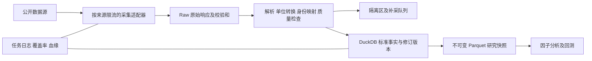

# A 股本地数据库建设方案

> 2026-09-23 审计说明：本文是 2026-09-21 起的建设方案和历史验证记录。此后仓库已有 `crates/quant-research/` Rust 研究/回测及 `apps/web/` React 页面；实际当前状态以 `README.md`、`docs/STATUS.md` 和代码为准。本文提及的 `验证记录.md` 在当前仓库不存在，历史实测数字不能代替本轮验证。

设计日期：2026-09-21。输入：用户提供的 a-stock-data v3.9.0 原文。

## 1. 结论与建设边界

推荐以 **Rust 采集与研究内核 + 原始文件归档 + DuckDB 标准库 + Parquet 研究快照** 建设单机研究数据库。Python 可以作为一次性数据检查工具，但不承担核心写入路径。先完成沪深北日线、证券主表、交易日历、复权与交易状态，再扩展财务、公告和事件数据。首期面向日频选股、因子研究与回测输入，不承担实盘委托或完整逐笔行情存储。

暂按个人研究、单机本地存储、免费公开源优先、2016 年至今为历史目标设计；这些是规划假设，不是已经得到验证的覆盖范围。北交所、退市证券、财务历史版本和分钟线分别记录实际可得起点，不能用统一“十年全量”掩盖缺口。

**可靠的含义是可追溯、能发现缺失、能恢复、能重放，并且不把不可靠数据交给回测。公开接口不能提供持续可用或历史完整的保证。** 对验证后仍缺失且策略必需的数据，补充有相应历史覆盖与使用授权的供应商；在采购前先验证样本，不预设需要付费。

本文编写时交付的是设计方案与验证底座。`src/`、`sql/schema.sql` 实现 Rust 样本 staging 库、版本留存、原始响应归档和 Parquet 导出；`warehouse.py` 保留为早期原型。2026-09-23 的研究/回测现状已另行记录于 `docs/architecture.md`。下文的全市场标准层、其他数据集、自动调度、备份恢复仍属于分期建设内容，不等同于已完成。

### Rust 兼容性验证（2026-09-21）

结论：**确认可用，后续以 Rust 为唯一主写入和研究内核。** 当前环境使用 Rust 1.98.1，项目最低版本锁为 Rust 1.85.1；`duckdb-rs` 使用固定版本 `1.10505.0` 与 `bundled` 特性，DuckDB C++ 引擎由 Cargo 编译和静态链接，不依赖本机预装 DuckDB。

| 已验证能力 | 结果 | 实现位置 |
|---|---|---|
| 文件型 DuckDB 创建与 schema 迁移 | 通过 | `src/lib.rs::Warehouse::open` |
| 原始 JSON 归档、哈希与采集血缘 | 通过 | `src/lib.rs::archive_raw` |
| 腾讯日线样本导入、单位转换、OHLC 约束 | 通过 | `src/lib.rs::parse_tencent_day_response` |
| 幂等写入及源修订留存 | 通过 | `staging.daily_bar_revision` |
| 单进程写者锁 | 通过 | `.writer.lock` + `fs2` |
| DuckDB 导出 ZSTD Parquet 并回读核验 | 通过 | `src/lib.rs::export_snapshot` |

实测发现 DuckDB **不支持跨 schema 外键**。因此 `staging.daily_bar_revision.run_id` 不使用指向 `ops.ingest_run` 的数据库外键；写入在同一应用事务中维护，正式发布前再执行“每个 run_id 均存在且状态为 SUCCESS”的血缘校验。这是 DuckDB 的能力边界，不影响样本库的版本、查询和 Parquet 兼容性。

实际验证命令：`cargo fmt --check`、`cargo test`、`cargo clippy --all-targets -- -D warnings`，以及本地 fixture 导入、Parquet 导出、状态查询。四项单元测试覆盖字段及单位、异常拒绝、修订幂等与单写者锁。没有使用真实行情接口，故本验证不对任一数据源的当日可用性作结论。

### P0 日频闭环实现（2026-09-21）

已实现的命令如下；所有下载响应都会保存原文、哈希与请求 URL，下载失败不会以空数据替代。

```text
cargo run -- --data-dir data-core fetch-calendar --year 2026 --month 9
cargo run -- --data-dir data-core fetch-tdx-day --trade-date 2026-09-18
cargo run -- --data-dir data-core fetch-adjustments --symbol sh600519 --kind qfq
cargo run -- --data-dir data-core import-status-csv --source <source> --source-url <url> --input <status.csv>
cargo run -- --data-dir data-core publish-daily --trade-date 2026-09-18
cargo run -- --data-dir data-core export-etf-day --trade-date 2026-09-18
cargo run --release -- --data-dir data-core backfill-etf-history --start 2016-01-01 --end 2026-09-21
```

`fetch-tdx-day` 建立沪深北的证券观察主表、当日代码/名称版本和不复权日线。它只将合规 OHLC 写入日线表，并按通达信包的市场级最低有价行数做完整性检查；包中不能按股票 OHLC 解释的其他证券保留在原始 ZIP，不会伪装成股票 K 线。代码号段识别出的 `EQUITY_CANDIDATE` 仅是候选分类，仍需官方上市/退市资料确认后才能升级为 `EQUITY`。

`fetch-calendar` 读取深交所完整自然月日历，发布时要求该日期明确为开市。`fetch-adjustments` 存储新浪 qfq/hfq 因子全版本，`research.daily_bar_qfq` 仅在存在对应因子时给出复权价。`import-status-csv` 是状态历史的受控入口，CSV 必须含 `symbol,effective_date,trade_status,is_st,limit_rule_id`；未知状态始终不能作为可交易状态。`publish-daily` 仅在日历与沪深北包级覆盖率通过时导出指定交易日的 ZSTD Parquet 快照。

ETF 行情随通达信全市场盘后包落库。分类同时要求证券简称含 `ETF` 标记，并属于上交所 `5xxxxx` 或深交所 `15xxxx` 基金号段；分类依据写入 `core.instrument_classification_revision`，当前不依赖容易混淆 LOF 与历史分级基金的单一号段推断。研究查询使用 `research.etf_daily_bar`，其中价格为不复权交易价格，成交量为份、成交额为人民币元。`export-etf-day` 可将指定交易日导出为 ZSTD Parquet，供 Rust 研究程序只读消费。

2026-09-21 直连下载并导入了 2026-09-18 通达信盘后包：ZIP 为 2,741,589 字节，SHA-256 为 `613cbca9817cde6c5f86de7659ee86d4224b29341265b2ceaf8960ed83677ca6`，六个包内文件全部通过解压校验。数据库写入 10,356 条合规行情，其中 ETF 1,674 条；该数字是当日通达信观察集，尚未用交易所 ETF 产品名录证明“全量无遗漏”。

历史 ETF 日线由腾讯三个 K 线入口提供，强制 `adjust=''` 保存未复权价格。`backfill-etf-history` 将区间拆成最长 700 个自然日的窗口，成功、上市前空窗与失败分别记录在 `ops.history_backfill_window`；再次运行会跳过成功或确认空的窗口。每个响应保留原文、URL 与 SHA-256，写入按窗口事务提交。全量任务应使用 `--release`；可用 `--symbol sh510050` 做单标的恢复，或用 `--limit` 控制批次规模。

命令默认在标准错误流逐只输出进度，包括完成比例、当前证券新增行数、成功/空/跳过/失败窗口、累计耗时和预计剩余时间；最终汇总 JSON 保持在标准输出流，便于脚本解析。无人值守且不需要进度时可加 `--quiet`。

当前证券全集来自 2026-09-18 当日观察，因此批量回填覆盖“目前仍在列表中的 ETF”，不包含在该日前已退市且不再出现的 ETF。它适合当前 ETF 池的因子研究；在接入交易所历史产品名录之前，不能用于无幸存者偏差的 ETF 上市/退市研究。

#### 2016年以来沪深股票与ETF历史日线回填（进行中）

新增 `backfill-market-history`，按 `core.instrument` 中本机已观察到的沪深 `EQUITY_CANDIDATE`、`EQUITY`、`ETF` 证券调用腾讯未复权日线，默认从 2016-01-01 起。每个响应的原文、URL、SHA-256 与窗口结果均留存；成功/确认空窗口断点跳过，失败窗口可续跑。为遵循腾讯最多 640 根日线的返回上限，窗口为 800 个自然日；启动时展示证券数和总窗口数，每 25 个窗口输出完成率、成功/空/跳过/失败数、累计时间与 ETA。

```text
cargo run --release --offline -- --data-dir data-core backfill-market-history --start 2016-01-01 --end 2026-09-23 --sleep-ms 100
```

该命令只覆盖当前本机名录可见的沪深证券，无法补入本机从未观察到的退市证券；腾讯此接口不支持北交所，且历史响应不含成交额。故完成后是“当前已观察沪深证券池的 2016+ OHLCV 样本”，不是经交易所历史名录验收的全量 A 股数据库，也不能作为无幸存者偏差的历史 Universe。直连源验证于 2026-09-23：`sh600000` 2016 年请求 HTTP 200，返回有效历史日线；通达信官方包同日 TLS 握手失败，未将此解释为历史文件缺失。

本次批次启动时证券数为 6,882，2016-01-01 至 2026-09-23 共约 34,410 个请求窗口。首个单证券全区间试跑写入 2,588 行、6/6 窗口成功；交接时全量批次为 1,175/34,410 窗口（成功850、空325、失败0，ETA约7小时54分），仍在运行。首轮 700 天窗口曾执行约 150 个请求后中断并保留数据；这些与当前 800 天窗口边界不同的记录会被安全重取，行哈希阻止重复生成相同版本。

长度核验工具：

```text
cargo run --release --offline -- --data-dir data-core audit-market-history
cargo run --release --offline -- --data-dir data-core audit-trading-calendar --start 2016-01-01 --end 2026-09-24
```

它按当前 800 天窗口边界逐段比对 `ops.history_backfill_window.row_count` 与 `staging.daily_bar_revision` 中该证券的不同交易日数，并检查预期窗口是否都有成功/空状态、是否有失败。2026-09-24 抽样5只（沪市股票 `sh600000`、`sh600519`，沪市ETF `sh510050`，深市股票 `sz000528`，深市ETF `sz159919`）共25个窗口：5/5证券均有5/5窗口、失败0、源行数与入库不同日期数一致；行数依次为2590、2608、2608、2587、2607，日期范围均为2016-01-04至2026-09-24。这验证了样本回填长度与落库一致，不替代按官方交易日历逐日查漏或全市场完整性认证。续跑调整过结束日期时，旧末窗记录可能多一份；审计只统计本次目标的精确窗口，避免重复计算。

`audit-trading-calendar` 将样本腾讯日线与已保存的深交所官方日历逐日比对；未收录的日历日保持“未知”，不会推断为休市。2026-09-24 本地检查范围 2016-01-01 至 2026-09-24，共 3920 个自然日；官方月历覆盖 3858 日、标记开市 2570 日，尚缺 62 个日历日期（2017-01 与 2019-05 两个月）。在已覆盖的日历日期中，`sh600000`、`sz000528`、`sz159919` 分别缺 18、21、1 个开市日行情，`sh600519` 与 `sh510050` 未见缺日；五只证券在两个未覆盖月份内各有 38 个行情日期，暂不能由此日历认证。2017-01 官方接口返回 30/31 日，原始响应和拒绝原因保存在 `data-core/raw/szse-incomplete/2017-01/`；2019-05 接口多次超时。此结果是样本审计，不能区分停牌与行情源漏数，也不能认证全市场完整性。

2026-09-22 已完成首批直连回填验证：数据库现有 24 只 ETF 的腾讯历史日线共 55,150 行，最早日期为 2016-01-04，最近日期为 2026-09-21。最近一次 20 只批次新增 42,300 行，102 个有效窗口、12 个确认空窗、0 个失败窗口，并成功跳过 6 个已完成窗口。剩余当前 ETF 可用同一命令分批续跑；完成交易所历史产品名录前，不将当前名单回填结果标记为无幸存者偏差的全历史发布版。

在线验证结果：深交所 2026-09 日历已入库 30 条，新浪 `sh600519` 前复权因子已入库 33 条。通达信 ZIP 在当前网络出现超时、连接被对端关闭和包内非股票 OHLC 行，适配器已增加 HTTP/1、180 秒读取上限、三次退避重试和离线 ZIP 导入命令；在网络恢复或取得 ZIP 后可用 `import-tdx-zip` 重放。尚未因该源失败发布任何全市场日线快照。

## 2. 对 skill 的工程评估

Skill 安装位置：`/Users/yibinzhang/.codex/skills/a-stock-data/SKILL.md`。原文 SHA-256：`d204019714cc15cf0cf5f06647a8f4b8b67c4bb25af3c78ef5e0aa7dfd45e81e`。保留原文；项目适配器独立维护，不在运行时执行整份 Markdown 中的示例代码。

该文件提供 15 类、85 个入口的取数参考，作者的验证日期与本机验证分开记录。以下结论来自所提供文本及代码审阅，除验证记录另行注明外，尚未逐接口实测：

| 问题 | 对建库的影响 | 处理原则 |
|---|---|---|
| “腾讯不封 IP”与文中限流记录并存 | 不能保证稳定批量下载 | 限速、重试预算、熔断；同后台三个域名不算独立备源 |
| mootdx 行情命令标为失效 | 不能作为行情主干 | 暂不安装或依赖；财务/F10后续单独验证 |
| 腾讯日线默认 qfq | 直接复制默认参数会存入复权价 | 原始事实层强制 `adjust=''`，复权另建派生层 |
| 腾讯无真实成交额，分钟返回字段易误读 | 均价×量是估算，不是真实成交额 | `amount_cny=NULL`；估算值另列且标记方法，不填事实列 |
| 腾讯、baostock 不满足北交所历史需求 | 沪深备源无法补齐北交所 | 北交所单独覆盖矩阵；盘后包与官方数据单独验收 |
| 通达信包包含“全部证券” | 沪市万余条并非万余只 A 股 | 按证券主表和生效期过滤，禁止仅凭行数宣称全市场 A 股 |
| 通达信历史包不是逐日验证 | 个别成功日期不代表区间连续 | 逐交易日登记可用性；404分类为待发布/缺历史/休市待核实 |
| 股号可能迁移，指数与股票可能同码 | 错认证券比缺行更难发现 | 使用永久 instrument_id、市场、类型、有效期代码映射 |
| 指数权重、概念、热榜等主要是当前快照 | 无法自动还原过去状态 | 从现在起归档；不拿今天成分填历史 |
| 财报三表可能返回修订后的历史值 | 有报告期不等于有历史可见版本 | 公告发布时间、首次观察时间、修订版本独立保存 |
| CYQ 是模型推演、资金流是供应商口径 | 不能当真实逐笔持仓或统一标准 | 派生层存模型版本；资金流保留来源，不跨源直接拼接 |
| 部分示例关闭 TLS 校验、吞异常或截断分页 | 会掩盖请求失败与半截结果 | 正式适配器保持证书校验、严格异常与完整分页契约 |

安装 skill 不等于安装全部依赖，更不等于获得所有接口的服务承诺。本次底座仅需要 DuckDB 与 Python 标准库，后续按数据集安装依赖并锁版本。

## 3. 架构与部署



| 组件 | 职责 | 选择理由与边界 |
|---|---|---|
| Rust | 获取、标准化、质量校验、补采与研究内核 | 类型约束、并发控制与后续量化研究统一；适配器与存储解耦 |
| Raw 文件目录 | 保存 JSON/ZIP/CSV/PDF 原文、URL、参数、时间、哈希 | 数据源更正或解析器改变后可重放 |
| DuckDB | 主数据、日频事实、修订表、质量结果、SQL 查询 | 适合本地分析；每个数据库文件只安排一个写进程 |
| Parquet + ZSTD | 不可变研究快照、后期大量分钟数据 | 回测并行读取发布版本，避免直接争用写入中的库 |
| 单个调度进程 | 时间触发、断点恢复、串行提交 | Mac 可用 launchd，Linux 可用 systemd timer；首期不引入分布式队列 |
| 备份目录/独立介质 | 冷备数据库、原始文件、清单、配置 | 同一硬盘上的另一目录只能算快照，不能抵御磁盘损坏 |

DuckDB 官方文档说明同进程写入与多进程访问的并发边界；本方案采用单写进程，其他进程读已发布 Parquet 快照。[并发文档](https://duckdb.org/docs/current/connect/concurrency)

DuckDB 支持直接读写 Parquet；冷数据不必再导入第二套常驻服务。[Parquet 文档](https://duckdb.org/docs/current/data/parquet/overview)

不在第一阶段引入 Kafka、ClickHouse、PostgreSQL 或 Kubernetes。若后续出现多用户服务、连续高频写入或并发写进程需求，再以压测结果决定迁移：PostgreSQL 管任务与主数据，ClickHouse 管海量行情，保留 Raw 和 Parquet。

建议目录：

```text
A股量化/
  src/                      已实现：Rust 样本导入、校验、版本入库、导出
  warehouse.py              早期 Python 原型，不再作为主入口
  sql/schema.sql            已实现：样本 staging/ops 表
  tests/                    已实现：关键契约测试
  docs/                     方案、验证记录
  data/market.duckdb         已初始化或由 init 创建
  data/raw/source/run_id/   原文与请求清单
  data/snapshots/version/   样本不可变导出；正式版增加数据集目录
  data/quarantine/          规划：质量异常明细
  data/backups/             规划：本地恢复快照
```

正式快照按数据集、年份分区；分钟线按年份/月分区并按证券、时间排序，避免每证券每日一个小文件。推荐压缩后每文件约 128–512MB，依据真实查询与文件大小调节。发布清单记录每个文件的哈希、行数、schema_version、来源版本和截止时间。

## 4. 数据范围与数据源分级

“备用”只有在证券覆盖、频率、单位、日期与字段含义都相容时才能替换。实时快照不作为历史日线备份，另一供应商的主力资金定义也不能覆盖原字段。

| 优先级/数据集 | skill 路由与首选 | 备用或补充 | 历史边界与更新策略 |
|---|---|---|---|
| P0 证券主表、代码沿革 | §6.6 baostock + 交易所名单 | 巨潮映射作辅助 | 必须含退市历史；北交所和迁码单独验证；每日差异归档 |
| P0 交易日历 | §12 深交所月历 | 沪北官方公告交叉核对 | 分市场记录，不能仅删周末；次月预取、每日核验 |
| P0 全市场日线 | §1.6 通达信盘后包 | §1.5 腾讯逐股补沪深；北交所另验 | 先验证 2022 年起包连续性，再扩展更早历史；不承诺包留存起点 |
| P0 沪深长历史日线 | §1.5 腾讯不复权分窗 | baostock/百度等验证后使用 | 按交易日历和上市期核验，不能只看到首尾日期就认定齐全 |
| P0 复权及公司行动 | §1.4 新浪因子、§4.4 分红 | 交易所/巨潮公告 | 每次下载存全序列版本；除权日扩大重算范围 |
| P0 停复牌、ST、交易限制 | §6.5、§6.8 | 官方状态公告 | 北交所不足单列；历史涨跌停规则按市场/板块/日期配置 |
| P1 历史估值及股本 | §6.5 baostock，§6.3快照 | 财报/股本事件 | PE负值与缺失分别保存；快照不反填历史 |
| P1 财务三表 | §6.4 新浪 | 同花顺F10、官方公告 | 原始披露与重述版本分开；季度累计值与单季值不可混用 |
| P1 行业与指数 | §6.7申万历史、§12中证/国证 | 官方调样公告 | 申万有效期不自动等于可知时点；指数当前成分不能冒充历史 |
| P1 公告与事件 | §7、§14 巨潮/东财 | 交易所、公告PDF | 发布、事件发生、生效三个时间；回购计划与实施分表 |
| P2 资金面 | §3、§4 龙虎榜/两融/大宗/股东户数/资金流 | 官方两融龙虎榜、新浪资金流 | 两融余额与发生额分列；资金流源间差异保留 |
| P2 新闻与研报 | §2、§5、§10 | 新浪/财联社等 | 列表、正文、PDF独立；研报列表不能补评级/目标价；按需下载正文 |
| P2 打板与舆情 | §8、§10 | 部分无独立备源 | 当日快照易消失，计划从启用日起积累；失效不阻断核心日线 |
| P2 宏观与利率 | §11 官方机构 | 发布原文 | 月份/观测日与发布日期分别存；宏观修订也需版本 |
| P3 分钟与实时 | §1.5腾讯、§1.2快照 | 有限同花顺分钟/官方快照 | 腾讯分钟≤320根，历史不能任意回补；先自选池后全市场 |
| P3 ETF/期权/可转债/期货 | §4.7、§9、§13、§15 | 对应交易所 | 独立资产模型；期权到期、合约乘数、转股价版本、交易时段单独管理 |

先落地 P0 再开发 P1。85 个端点全部一次性接入会扩大维护面，无法提高核心数据可靠性。

## 5. 标准数据模型与契约

以下是正式层的逻辑设计，未声称这些表已全部实现。实际底座表位于 `staging` 与 `ops`，刻意不直接发布研究用标准数据。

| 逻辑表 | 主键/业务粒度 | 必备内容 |
|---|---|---|
| instrument | 永久 instrument_id | asset_type、交易所、币种、上市/退市日及证据；不随改名迁码改变 |
| instrument_symbol_history | instrument_id、source、symbol、valid_from、版本 | old/new symbol，有效起止；未知迁码日不能猜测 |
| trading_calendar | exchange、trade_date、版本 | 是否交易日、开闭市时段、发布时间、来源 |
| daily_bar_revision | instrument_id、trade_date、source、revision_id | 不复权OHLC、实际成交量/额、来源时间、原文引用、质量状态 |
| adjustment_factor_revision | instrument_id、effective_date、method、source、revision_id | 因子、基准日、观察时间、公式版本 |
| security_status_history | instrument_id、生效区间、版本 | ST、停牌、板块、可交易性、涨跌幅限制及规则ID |
| financial_fact_revision | instrument_id、period_end、statement、scope、metric、版本 | 数值、单位、合并/母公司、累计/单季、披露日、修订链 |
| valuation_daily_revision | instrument_id、trade_date、source、版本 | PE/PB/PS、TTM口径、总/流通股本；单位显式 |
| classification_history | instrument_id、体系、valid_from、版本 | 行业/概念代码、生效区间与可知时间 |
| index_membership_snapshot | index_id、snapshot_date、instrument_id、版本 | 权重、实际生效日、是否仅当前快照 |
| corporate_action/event | instrument_id、event_id、版本 | 事件类型、公告/生效/执行时间、状态、前后值 |
| announcement/document | source、document_id、版本 | 标题、发布时间、URL、正文/PDF哈希、证券关联多对多 |
| macro_observation_revision | indicator、observation_period、版本 | 观测值、单位、首次发布时间、修订时间 |
| ops.ingest_run / task / quality_issue / dataset_release | run/task/issue/release_id | 断点、原文哈希、质量检查、发布状态、研究快照manifest |

标准字段约定：

1. 股票价格使用人民币/股，成交量使用股，成交额使用人民币元。所有适配器声明 source_unit 与转换规则，不能用“看起来差不多”判单位。指数、期货、期权不套股票单位。
2. 价格与金额优先 DECIMAL；原始数值文本保留。缺失为 NULL，0 是实际值。不得将空字符串、停牌缺数、源异常统一置零。
3. 时间戳存 UTC，交易日与调度按 Asia/Shanghai；仅日期精度的发布时间另存 precision。跨时区不得用运行机器的 date.today() 推导交易日。
4. 源事实留多版本；标准视图按确定的优先级和质量规则选值，不能由“谁最后下载”决定来源。
5. 任何标准行都能追到 run_id、source_url、raw_sha256、adapter_version。标准口径变化提升 schema_version 或 transform_version。
6. 证券与日历决定应有数据集。数据包总行数阈值只能检查包结构，不能代替 A 股覆盖率验收。

### 时点可见性：避免前视与幸存者偏差

必须区分 `event_time/effective_date`（何时发生/生效）、`published_at`（源何时公开）、`first_seen_at`（系统何时第一次观察）、`recorded_at`（何时入库）。

提供两种研究模式：

- **真实历史运行复现**：只允许 `first_seen_at <= decision_time` 的版本。本日才抓到的十年前数据，不声称十年前本系统已持有。
- **历史研究重建**：使用有可靠证据的公开时间与当时版本；若只能得到今天修订后的数值，标记 `pit_confidence=unverified`，严格 PIT 回测拒绝使用。

只有公告日期、没有具体时间时，保守将其可用时间设为下一交易日开盘；如果停牌或特别交易安排影响执行，交给交易模拟器处理。财报的报告期末不是可用时间。未来指数调样公告可以在公告时知晓，但不能提前改变有效成分。

日线收盘数据不能用于同日收盘前的信号。停牌行不造可成交K线；价格展示可有独立前值填充视图，但必须带 `is_imputed` 且禁止用于成交模拟。

样本底座的 `observed_at` 只表达本次观察时间，不能据此还原源的历史发布时间；这一限制在正式 PIT 层上线前持续存在。

### 复权契约

原始价作为唯一成交价格事实。比例复权仅在因子含义经过验证后使用：若源定义后复权价为 `P_t * F_t`，则基准日 b 的前复权价可定义为 `P_t * F_t / F_b`。不同供应商因子不能直接套同一公式；必须用分红/送转/配股样例对拍。

skill 提到腾讯前复权存在等差口径、长历史可能出现非正价格，因此不能直接用其复权结果计算长期收益。因子版本、基准日与算法写入快照。成交量不随价格机械复权；收益计算与执行价格分开，含现金分红的总回报需明确分红再投资假设。

## 6. 采集、补历史与发布流程

### 首次建库

1. 建证券全集和代码历史，含退市证券；标明哪些年份全集未验证。核验沪深北交易日历。两项不过关，不发布“全市场完整”。
2. 选沪市主板、深市主板、创业板、科创板、北交所、ST、停牌、次新、退市与除权样本，各类至少有代表。先测 20 个交易日，再扩到 1 年。
3. 通达信按交易日下载全市场包，原始 ZIP 保留；过滤证券类型之前保留包的原始统计。按上市有效期检查 A 股应有名单。
4. 沪深缺口按证券/时间窗交给腾讯等源补采。窗口默认不超过 700 个自然日；校验真正返回区间、重复与缺日。退市股和北交所缺口单独列出，不无限重试。
5. 分红、复权、ST、停牌、股本先与行情打通，再上财务和事件。对缺失来源和语义不可替换的字段保持 NULL。
6. 建覆盖报告后发布版本：已收行数、应收行数、已解释空缺、未解释缺失、最早/最新日期均按市场/资产/数据集拆分。

补采优先于重新抓全量。每任务使用 `(dataset, source, instrument_or_market, window, adapter_version)` 唯一任务键；网络尝试可以多次，标准数据的逻辑写入幂等。

### 每日流程（计划值，非供应商发布时间保证）

| 北京时间 | 工作 | 异常处理 |
|---|---|---|
| 08:00 | 校验日历、上市/迁码/状态更新、检查前日缺口 | 日历未知则暂停相关市场自动发布 |
| 盘中（P3启用后） | 有限股票池分钟线、事件快照 | 记录数据截止时间；窗口溢出列为永久/待补缺口 |
| 15:30 | 收盘初版检查 | 标记 provisional，不标当日最终完整 |
| 18:30 / 20:30 / 22:30 | 尝试盘后包、日线及估值增量 | 未发布与下载失败分别计数，有限次数重试 |
| 次日 07:30 | 漏数补采、质量报告、正式快照发布 | P0未解释缺失则保留上一合格版本，并显示陈旧状态 |
| 每周 | 回查近20交易日；扩展历史覆盖 | 发现修订追加版本，重新发布受影响分区 |
| 每月/财报季 | 复查财务修订、股本、因子全序列和代码映射 | 不能仅靠滚动20日捕获多年修订 |

Mac 睡眠不会保证采集发生；恢复后按最后成功水位补任务。需要持续盘中采集时将同一项目部署到常开设备，并保持单写者。以上时间表是方案，当前未注册常驻任务。

### 请求与故障契约

- 东财按来源族全局串行，起步每次 2 秒加随机抖动；多个任务共用预算。skill 的社区阈值不是保证值。其他来源先每 2 秒一次，按实测再调。
- 429 尊重 Retry-After；超时/5xx 指数退避并加抖动，单任务建议最多 3 次。403暂停对应来源并转语义相容备源。参数错误与解析器结构错误不盲目重试。
- 失败分类：`NOT_PUBLISHED`、`NO_OBSERVATION_CONFIRMED`、`OUT_OF_COVERAGE`、`RATE_LIMITED`、`TRANSPORT_ERROR`、`SCHEMA_CHANGED`、`PARTIAL`。HTTP 200 和空列表不能单独证明“确实没有”。
- 熔断按 source_family 管理，防止同后台多域名重复冲击；日线可用备源不代表分钟线也可降级。
- 翻页记录总条数/游标，重复页、少页、max_rows截断均视为不完整。API调用成功率与数据完整率分别统计。
- 原文先落盘，标准数据与任务成功状态同事务提交。进程重启识别超时 RUNNING 任务，先验证原文再重放。回放用原采集时间，不改为现在。
- Parquet 写到新的版本目录，校验后原子发布 manifest；查询只读清单列出的文件，避免同时读新旧分区或半截数据。

## 7. 质量与验收

### 每批必须检查

| 检查 | 规则 | 失败结果 |
|---|---|---|
| 身份 | 源代码在请求日能唯一映射证券 | 无法映射进隔离区，不能凭号段补身份 |
| 唯一性 | 标准版本中每证券/日/口径唯一 | 重复或跨页重复阻断发布 |
| OHLC | 原始股价有限、正数，low≤open/close≤high | 隔离并保存原响应 |
| 单位 | 量额非负、转换规则已验证 | 不凭数量级自动修正 |
| 日期 | 日历交易日、上市有效期内、落在请求窗 | 区间越界按结构/请求异常处理 |
| 覆盖 | expected=当日在市且按定义应有行情的证券 | 停牌需证据解释；未知缺数不当停牌 |
| 新鲜度 | 数据自带时点与期望交易日匹配 | 定格报价与实时行情分开 |
| 跨源 | 同日不复权同币种价格逐市场抽样 | 收盘差超过一个适用最小价位或预设精度容差触发复核 |
| 财务 | 单位、累计/单季、合并范围一致；会计恒等关系作软检查 | 不能跨报表口径强制“修平” |
| 修订 | 新值与已存值比较，保留旧版本 | 禁止静默覆盖研究快照 |

`amount / volume` 可与 high/low 做诊断，但交易方式与供应商量额范围可能不同，不能一条公式自动判死所有记录。涨跌幅限制需按板块、上市阶段、风险状态与历史规则核验，不写死统一10%。

### 发布门槛与阶段验收

- 定义范围内 P0 应有记录覆盖 100%，或每一个缺口都有被验证的业务原因；无法解释的缺口不能藏在“99%成功率”里。
- 核心必填字段合法率100%，未处理重复0，未知证券映射0；所有标准行均可追溯原文。
- 同一批重跑不增加重复事实，源修订保留旧值；来源回滚到旧数值仍能记录新的修订事件。
- 明确区分数据集发布：事件源失败不必阻断合格行情，但严格研究快照声明各组成数据集截止时间和缺口。
- 断网、坏JSON、重复页、返回空、下载半截、进程中断、磁盘不足、迁码、除权、停牌、退市至少各有验证用例。
- 正式上线前连续10个交易日完成增量与报告，且成功做一次独立恢复演练。该门槛是计划，当前样本测试不代表通过上线验收。

## 8. 容量、成本与性能

按 5,500 只股票、每年250交易日估算，数量仅用于预算，不代表当前证券数：

| 范围 | 行数公式 | 规模 |
|---|---|---|
| 10年日线 | 5,500×250×10 | 约1,375万行 |
| 1年5分钟 | 5,500×250×48 | 约6,600万行 |
| 1年1分钟 | 5,500×250×240 | 约3.3亿行 |

若每行有效压缩后按 40–100 字节做粗预算，十年纯日线核心字段约0.55–1.38GB、全年1分钟约13.2–33GB；这不是文件大小承诺，也不包含元数据、原始响应、宽表、修订、临时重建空间与备份。先用一个月真实数据计算 bytes/row，再乘年数和2–3倍空间余量。PDF与新闻正文可能远大于日线，应另设下载与保留预算。

单机起步建议16GB内存、为项目预留至少100GB SSD；这是保守规划，不要求立即购置。全市场分钟、长期PDF和多副本存储再按实测扩容。查询性能先测“十年单股”“一年全市场截面”“批量因子窗口”三类，记录机器配置、冷/热缓存、数据版本；未压测前不承诺毫秒级或固定吞吐。

补历史时间按请求数而非证券数估计：5,500只×每只约6个700日窗口，约33,000请求；间隔2秒仅等待就约18.3小时，另加请求耗时、失败重试和来源限流。因此优先使用批量盘后包，长历史按后台断点任务执行，不能承诺一次会话补完。

## 9. 备份、恢复和运维

建议研究日线目标 RPO≤1个交易日、RTO≤4小时，需实测确认；分钟级恢复目标另定。能够再次下载不算备份，因为供应商可能撤回历史。

1. 每日合格发布后，写进程执行 checkpoint 并关闭连接；在独占锁内复制 DuckDB 文件。Raw和发布清单做增量备份，先校验再标成功。
2. 每周复制一份到独立介质；第二份独立地点副本按用户的存储条件配置。不默认为云同步已经可靠，备份包含配置、schema与依赖锁定文件。
3. 保留7个日备份、4个周备份、12个月备份作为初始策略；调整前测实际空间。研究版本有实验引用时不能自动清理。
4. 恢复到新的目录，校验哈希、行数、schema_version、原文引用和样本查询，再切换使用路径；禁止覆盖唯一现存库。
5. 首次上线和之后每季度做恢复演练，记录耗时与丢失窗口。坏原文不能继续作为“有效备份”。

运维报告至少展示：每市场最新合格交易日、各数据集水位、未解释缺口、隔离数量、源健康、任务失败原因、最后成功备份、磁盘余量。陈旧数据必须显示实际截止日。

## 10. 实施里程碑

以下工期是工程工作量估计，外部数据可用性、历史补采与连续交易日验收另计。

| 阶段 | 内容 | 完成标准 | 参考工作量 |
|---|---|---|---|
| M0 本次 | skill安装、设计、日线样本底座、关键测试 | 清楚披露实际验证结果与限制 | 本次交付 |
| M1 数据核心 | 官方证券全集/日历、代码映射、通达信包、沪深补采、覆盖报告 | 20日多类型样本及1年覆盖检查 | 3–5个工作日 |
| M2 回测基础 | 历史补齐、退市、停牌/ST、复权、分红、PIT框架 | 除权/迁码/停牌/退市样例通过，缺口逐项可见 | 4–7个工作日及下载时间 |
| M3 财务事件 | 三表、估值、行业、公告、指数快照 | 披露时点与修订版本可查询 | 5–10个工作日 |
| M4 运维上线 | 调度、熔断、原子发布、备份恢复、监控 | 连续10个交易日及恢复演练 | 3–5个工作日及观察期 |
| M5 扩展 | 资金、新闻、分钟、衍生品按策略价值排序 | 每类独立数据契约和源验收 | 单独估算 |

建议正式建库先以2016年至今沪深A股为目标、北交所按实际历史单独说明，并从现在起持续保存容易消失的状态和成分快照。扩大资产类别之前，先保证P0数据可追溯与研究重放。

## 11. 来源与证据边界

- 用户提供的 a-stock-data v3.9.0 是本设计的端点与字段主要依据；[项目主页](https://github.com/simonlin1212/a-stock-data)已打开核对项目背景，未用远程新版本覆盖附件。
- [DuckDB 并发](https://duckdb.org/docs/current/connect/concurrency)及[Parquet文档](https://duckdb.org/docs/current/data/parquet/overview)用于数据库选型边界。
- 作者历史“实测”不等同于本机当日验证。旧文提及的 `验证记录.md` 当前不在仓库；本轮实测摘要见 `HANDOFF.md`。无完整证据的官方历史覆盖、PIT 可靠性和接口可用性均作为待验收事项。
